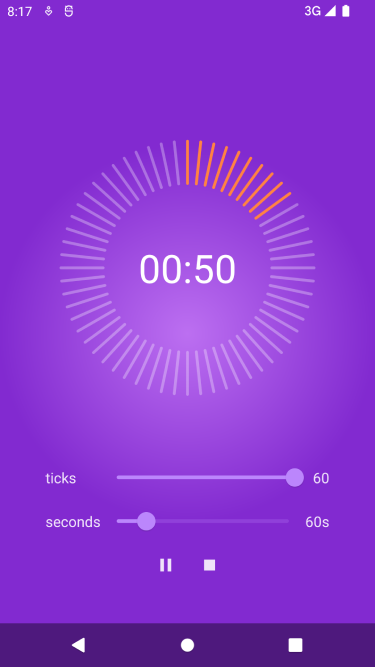
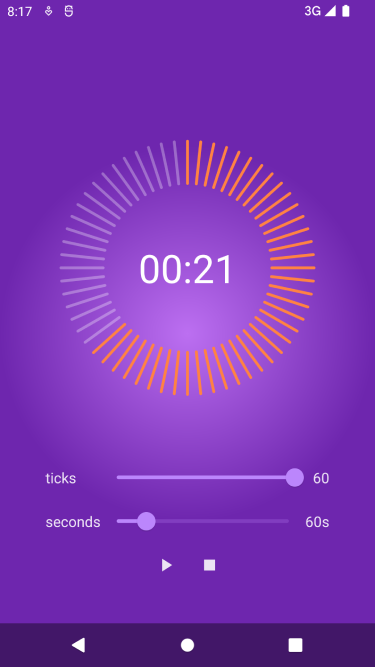
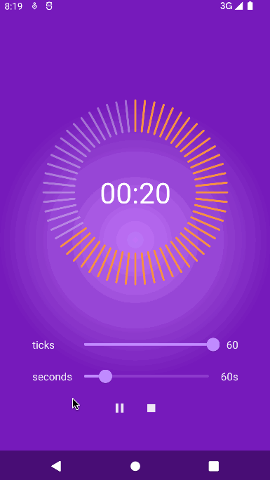

# CountDown
jetpack compose count down

## 简单说明

inspired by [https://github.com/lelandrichardson/compose-dogfooding/tree/main/Countdown](https://github.com/lelandrichardson/compose-dogfooding/tree/main/Countdown)

部分样式来源于以上repo，没有上述repo复杂，只是简单的倒计时，学习布局的同时进行改良，主要有以下不同点

- 角度由-180 ~ 180度改成 0 ~ 360 度，方便之后的角度计算
- 增加ticks和second的slider，可以进行自定义选择
- 随着时间的减少，radial背景会逐渐加深
- 当时间小于10秒之后，会出现💓的动画

## 部分截图

### 开始倒计时

### 暂停

### 完整示例（时间有点长）

